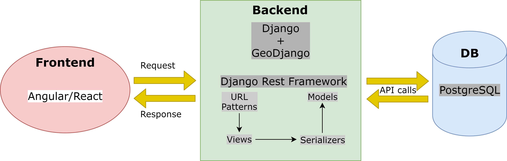

# Earthquake Data Visualization

This web app aims at visualizing earthquake point data provided in geojson format.

The features will include:
1. Show a worldwide heatmap
2. Show earthquake data filtered by a desired country

Architecture:
- Backend: Django + GeoDjango + PostgreSQL with PostGIS extension
- Frontend: Either a JavaScript framework or Django with a web template

### How to run the app?

Requirements to run this app:
   - Change directory to project home path
   - Create a venv and activate it
   - Install **Python >= 3.6**
   - Run the following command on terminal: **pip install requirements.txt**
   - Finally, run the following to serve the app: **python manage.py runserver**
   - Visit **http://localhost:8000/static/index.html**
